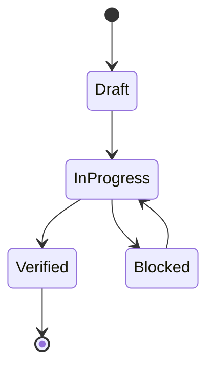

# Semantics

<!-- decapod:capability-overlay:background-processing:start -->

<!-- decapod:capability-overlay:persistent-state:start -->

## Persistent State Semantics Overlay

### Transaction Semantics
- All multi-entity operations MUST be atomic
- Read-after-write consistency within transaction boundaries
- Eventual consistency windows MUST be documented

### Migration Semantics
- Schema migrations MUST be backward-compatible
- Migration rollback procedures MUST be documented
- Data integrity checks post-migration

### Recovery Semantics
- Point-in-time recovery capability
- Recovery objectives MUST be selected for the project and recorded as proof obligations
- Recovery test cadence MUST be selected for the project and recorded as a proof obligation
<!-- decapod:capability-overlay:persistent-state:end -->
## Background Processing Semantics Overlay

### Retry Semantics
- Retry and backoff behavior MUST be selected and documented for each work class
- Poison-work handling MUST be selected and documented for each work class
- Retry MUST preserve the declared side-effect and idempotency semantics

### Idempotency
- Each job MUST declare whether it is idempotent, transactional, compensating, or otherwise duplicate-safe
- Deduplication or compensation mechanisms are project decisions and require proof
- Duplicate execution MUST follow the job's declared duplicate-handling semantics

### Poison Message Handling
- Messages failing after max retries go to dead letter queue
- DLQ MUST be monitored and alerted
- Manual replay capability for DLQ messages
<!-- decapod:capability-overlay:background-processing:end -->
## State Machines

## Invariants
| Invariant | Type | Validation |
|---|---|---|
| No promoted change without proof | System | validation gate |
| Canonical source-of-truth per entity | Data | interface/spec review |
| Mutation events are replayable | Data | deterministic replay |

## Event Sourcing Schema
| Field | Type | Description |
|---|---|---|
| event_id | string | globally unique event id |
| aggregate_id | string | entity/workflow id |
| event_type | string | semantic transition |
| payload | object | transition data |
| recorded_at | timestamp | append time |

## Replay Semantics
- Replay order:
- Conflict resolution:
- Snapshot cadence:
- Determinism proof strategy:

## Error Code Semantics
- Namespace:
- Stable compatibility window:
- Mapping to retry/degrade behavior:

## Domain Rules
- Business rule 1:
- Business rule 2:
- Business rule 3:

## Idempotency Contracts
| Operation | Idempotency Key | Duplicate Behavior |
|---|---|---|
| create/update mutation | request_id | return original result |
| async enqueue | event_id | ignore duplicate enqueue |

## Language Note
- Primary language inferred: Other

## Trajectory Concepts
The current todo-centric model shows signs of strain when representing complex, evolving work:
- **Atomic Task Bias**: Treating work as discrete tickets loses the narrative of how intent evolves over time through iterations, pivots, and discoveries.
- **Context Loss**: Each todo is an isolated unit; there's no inherent mechanism to carry forward assumptions, context summaries, or learned lessons across a sequence of related work.
- **Manual Coordination**: Agents must manually maintain epistemic custody (preserving intent-context-assumptions-action-proof chains) across multiple todos, which is error-prone.
- **Limited Retrospection**: While the worker loop records lessons, there's no first-class construct for representing the evolutionary path of a feature or system.
- **Overloading Todo Fields**: Current attempts to store trajectory-like data (e.g., in description, tags, or custom fields) fight against the todo subsystem's primary purpose as a task tracker.
- **Missing Abstractions**: Concepts like "work streams," "feature branches," "evolutionary trajectories," or "custody chains" lack explicit representation, forcing agents to encode them implicitly in todo relationships or external documentation.

Trajectories as first-class entities would provide:
- Explicit modeling of work sequences with temporal ordering and state evolution.
- Built-in mechanisms for preserving uncertainty and recursive continuity of assumptions.
- Natural encapsulation of intent-context-specs-state-proof chains.
- Improved tooling for visualizing and navigating work histories.
- Better alignment with how humans and agents actually work in iterative, discovery-driven processes.

## Recommended Redesign Seam for Trajectories
The most appropriate seam for introducing trajectories is at the intersection of the todo, spec, and workunit subsystems, without replacing any existing functionality:
1. **Extend the Workunit Concept**: Elevate workunit.rs from a per-task manifest to a potential trajectory container. A trajectory could be a linked series of workunits representing the evolution of a feature, architectural decision, or system component.
2. **Trajectory Spec**: Introduce a new spec type (e.g., `TRAJECTORY.md`) in `.decapod/generated/specs/` that documents the evolutionary path, key decisions, and state transitions of a coherent work effort.
3. **Minimal Core Changes**:
   - Add a `trajectory_id` field to the workunit model (optional, for grouping).
   - Create a new `trajectory.rs` subsystem for trajectory-specific operations (creation, linking, state transitions).
   - Extend the validation harness to check trajectory integrity (e.g., monotonic state progression, proof linkage).
   - Add CLI commands under `decapod trajectory` for trajectory management (init, list, show, transition).
4. **Preserve Existing Todos**: Keep the todo subsystem unchanged for atomic task tracking. Trajectories would coordinate or group todos but not replace them.
5. **Leverage Existing Mechanisms**:
   - Use the existing event journaling pattern for trajectory mutations.
   - Reuse the spec manifest system for trajectory specs.
   - Utilize the workspace subsystem for trajectory-scoped isolation (optional).
   - Depend on the constitution for trajectory-related directives (e.g., methodology/trajectory_lifecycle).

<!-- decapod:codebase-attestation:start -->
## Codebase Attestation

- Repository signal fingerprint: `d85fea05c327157b8eaa834019da77bceb474918bb9adfc1eb0873b51d54d9da`
- Significant implementation surfaces: `.github/` (2 files), `Makefile/` (1 files), `README.md/` (1 files), `artifact/` (6 files), `lab-example/` (1 files)
- Refreshed from the current codebase by `decapod specs.refresh`
<!-- decapod:codebase-attestation:end -->
