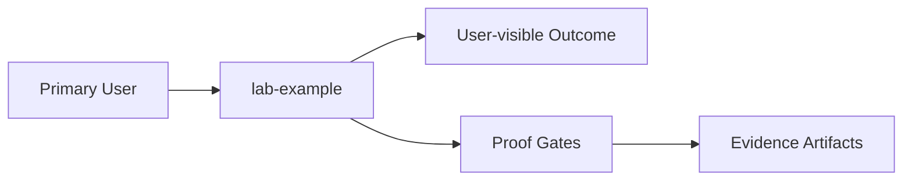

# Intent

## Product Outcome
- Contained fake project for bounded governance trace demonstration

## What This Project Is
lab-example is a application project built using python.
Contained fake project for bounded governance trace demonstration

Key operating facts:
- **Primary languages**: python
- **Detected surfaces**: cli

## Product View

## Inferred Baseline
- Repository: lab-example
- Product type: application
- Primary languages: python
- Detected surfaces: cli

## Scope
| Area | In Scope | Proof Surface |
|---|---|---|
| Core workflow | Define a concrete user-visible workflow | Acceptance criteria + tests |
| Data contracts | Document canonical inputs/outputs | [INTERFACES.md](./INTERFACES.md) and schema checks |
| Delivery quality | Block promotion on broken proof surfaces | [VALIDATION.md](./VALIDATION.md) blocking gates |

## Non-Goals (Falsifiable)
| Non-goal | How to falsify |
|---|---|
| Feature creep beyond the primary outcome | Any PR adds capability not tied to outcome criteria |
| Shipping without evidence | Missing validation artifacts for promoted changes |
| Ambiguous ownership boundaries | Missing owner/system-of-record in interfaces |

## Constraints
- Technical: runtime, dependency, and topology boundaries are explicit.
- Operational: deployment, rollback, and incident ownership are defined.
- Security/compliance: sensitive data handling and authz are mandatory.

## Acceptance Criteria (must be objectively testable)
- [ ] The focused test passes and the trace records the prompt, validation result, and evidence references.
- [ ] The direct Python assertion command passes and the trace is attached.
- [ ] Validation evidence references only files inside this fixture.
- [ ] No claim is made about credential isolation, universal capture, or empirical treatment effects.

## Epistemic Custody Fields

### Active Assumptions
- [ ] List any assumptions made to proceed.
- [ ] Flag assumptions that require future verification.

### Confidence & Risk Level
- **Confidence**: Low/Medium/High (Rationale: )
- **Risk**: Low/Medium/High (Impact of wrong assumptions: )

### Measured vs Inferred Facts
| Fact | Source (Provenance) | Type (Measured/Inferred) |
|---|---|---|
| `farewell("researcher")` returns the expected greeting | `traces/01-bounded-change.jsonl` and direct Python assertion output | Measured |

### Unresolved Contradictions
- [ ] List any evidence that conflicts with current assumptions or intent.

### Deferred Questions
- [ ] Questions to be answered later.

### Stop Conditions
- [ ] Explicit conditions under which the agent should stop and ask for help.

### Proof Required Before Completion
- [ ] Specific evidence needed to prove the outcome is met.

## Tradeoffs Register
| Decision | Benefit | Cost | Review Trigger |
|---|---|---|---|
| Simplicity vs extensibility | Faster iteration | Potential rework | Feature set expands |
| Strict gates vs dev speed | Higher confidence | More upfront discipline | Lead time regressions |

## First Implementation Slice
- [ ] Define the smallest user-visible workflow to ship first.
- [ ] Define required data/contracts for that workflow.
- [ ] Define what is intentionally postponed until v2.

## Open Questions (with decision deadlines)
| Question | Owner | Deadline | Decision |
|---|---|---|---|
| Which interfaces are versioned at launch? | TBD | YYYY-MM-DD | |
| Which non-functional target is hardest to hit? | TBD | YYYY-MM-DD | |
